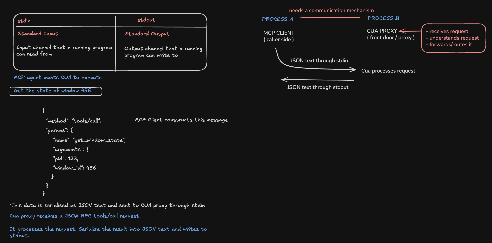
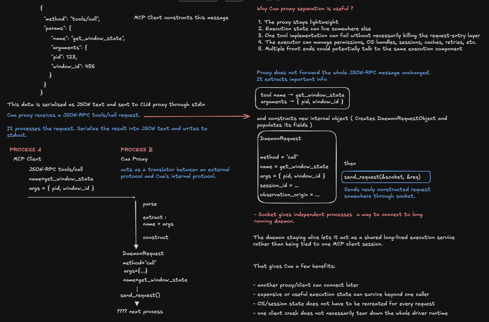
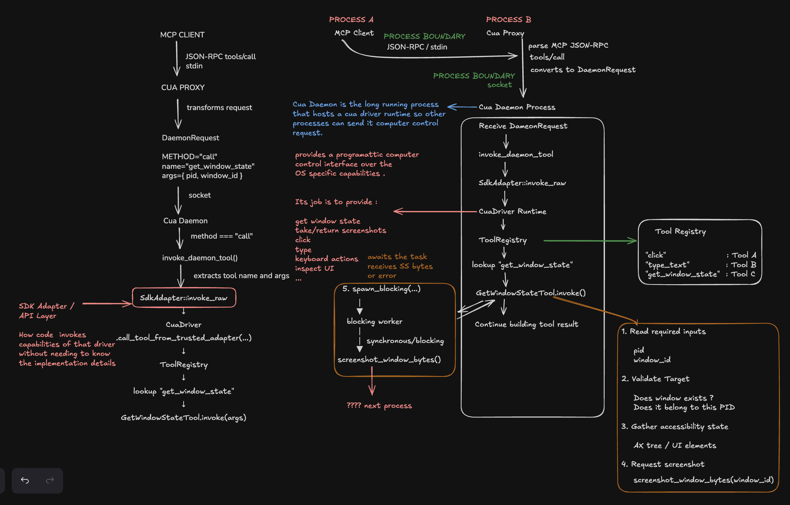

# Screenshot Execution Path

## Diagrams

MCP request entry through the proxy boundary.

Proxy-to-daemon dispatch into the driver runtime.

The inspected tool path stops at the screenshot boundary.

## Runtime Flow Established

MCP Client
  -> JSON-RPC `tools/call` via stdin
Cua Proxy
  -> parses external request
  -> extracts tool name + args
  -> constructs `DaemonRequest`
  -> sends over socket
Cua Daemon
  -> `invoke_daemon_tool`
  -> `SdkAdapter::invoke_raw`
  -> CuaDriver runtime
  -> ToolRegistry
  -> `GetWindowStateTool.invoke`
  -> validate pid/window ownership
  -> gather accessibility state
  -> `spawn_blocking`
  -> `screenshot_window_bytes(window_id)`
  -> ???

## Important Architecture Conclusions

1. Proxy and daemon have different responsibilities. The proxy is the request/protocol boundary: it translates the external MCP request into Cua's internal daemon request. The daemon is the long-running execution host and, for the inspected path, hosts the embedded Cua Driver runtime.
2. There are two important process boundaries: MCP Client -> Cua Proxy and Cua Proxy -> Cua Daemon. Daemon -> SdkAdapter -> CuaDriver -> ToolRegistry -> Tool is an in-process call path for the inspected route.
3. Cua Driver is the programmatic computer-control runtime/interface over OS-specific capabilities; it is not the concrete screenshot implementation.
4. ToolRegistry resolves a requested tool name to its registered implementation. It does not itself perform the computer action.
5. `get_window_state` is broader than “take a screenshot”: it validates the target and gathers accessibility/UI state before or alongside requesting screenshot pixels.
6. `spawn_blocking` does not make screenshot capture fire-and-forget. Blocking work runs on a blocking worker, while `GetWindowStateTool` awaits its completion before continuing.
7. Reliability distinction: request received != tool executed successfully != screenshot pixels successfully captured.

## Architectural Reasoning

The proxy/daemon separation may provide useful properties such as keeping the request-entry layer lightweight and allowing execution/runtime state to live in a longer-running process.

This is reasoning, not a verified design guarantee; it needs later code or runtime evidence.

## Still Unknown

- what happens inside `screenshot_window_bytes()`
- which component actually captures pixels
- ScreenCaptureKit / fallback behavior
- permission and capture failures
- how image bytes are produced
- how `GetWindowStateTool` builds the final result
- how the result returns to the MCP client

