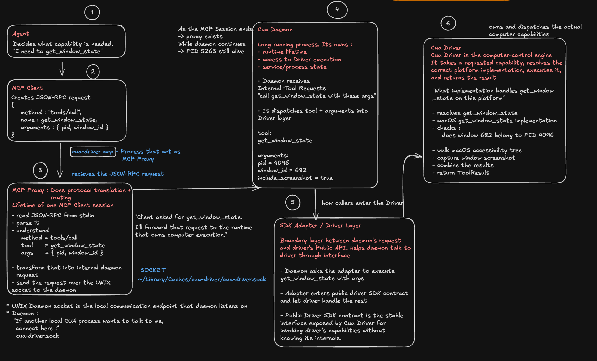

# Cua Driver Architecture — macOS `get_window_state`

This is the final architecture model established from the first
`get_window_state` happy path. It describes the released/prebuilt Cua Driver
on macOS, not a source build or the complete Cua codebase.

## Final architecture whiteboard



## Canonical flow

```text
Agent
→ MCP Client
→ MCP Proxy
→ Unix Domain Socket
→ Cua Daemon
→ SDK Adapter
→ Cua Driver
→ macOS implementation
```

## Responsibilities and boundaries

- The Agent decides which computer capability is needed.
- The MCP Client sends JSON-RPC operations such as `tools/call`; in the
  experiment, the terminal played this role.
- `cua-driver mcp` starts the MCP Proxy. It reads JSON-RPC on stdin, extracts
  the tool and arguments, converts them into Cua's internal daemon request,
  and sends that request to the daemon.
- The Unix Domain Socket (`cua-driver.sock`) is the local IPC endpoint between
  Proxy and Daemon. It is not a process.
- The Cua Daemon is the long-running runtime/service process. It owns service
  lifetime, accepts internal requests, and dispatches into Driver execution.
- The SDK Adapter is the small boundary from daemon/runtime callers into the
  public Driver SDK interface, keeping daemon logic independent of
  Driver/platform internals.
- Cua Driver resolves the requested capability to the platform implementation,
  executes it, and returns the result.

For macOS `get_window_state`, the Driver implementation validates the PID and
window, walks the Accessibility tree, re-checks scope, captures a screenshot,
combines state, and returns a `ToolResult`.

```text
macOS → Driver → SDK Adapter → Daemon → Unix socket → Proxy → stdout → MCP Client
```

## Verified runtime fact

An MCP Proxy/session lifetime is different from a Cua Daemon lifetime. A proxy
can exit when its stdin/MCP session ends while the daemon remains alive.

The concrete experiment, setup, trace format, and stop boundary are in
[CUA_HAPPY_PATH.md](./CUA_HAPPY_PATH.md).
