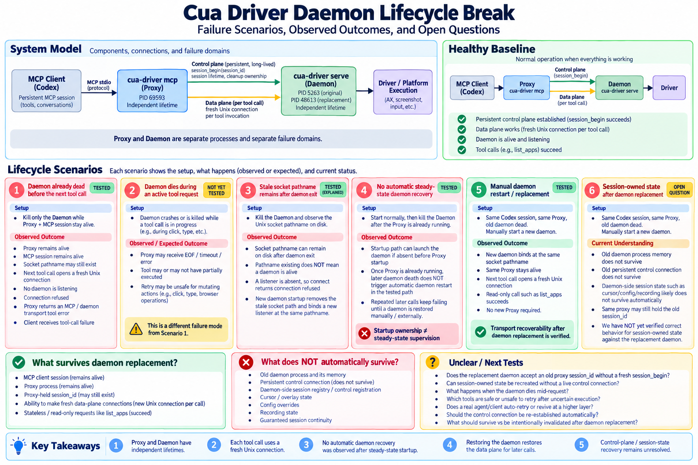

# Cua Driver — Daemon Lifecycle Break

## Goal

Understand what survives when the Daemon disappears while an MCP Proxy and its
MCP session remain alive, and what recovery is still unknown.

## Lifecycle break flowchart

## Healthy baseline

- The Proxy and Daemon are separate processes.
- The data plane forwards each tool call over a fresh Unix connection.
- The control plane is one persistent `session_begin(session_id)` connection.

## Scenario 1 — Daemon already dead before next tool call

**TESTED.** This is the tested case; Daemon death during an active request is
not tested.

**Setup:** A healthy Proxy, MCP session, Daemon, and successful `list_apps`.

**Prediction:** The next call would show whether the Proxy/session survived and
whether the Daemon was restarted automatically.

**Observed:** The Daemon was killed before the next `list_apps`. The Proxy and
MCP session stayed alive. The next call opened a fresh Unix connection and
failed with `Connection refused`; the Proxy returned a daemon transport/MCP tool
error. No automatic Daemon restart occurred.

**Conclusion:** A dead Daemon breaks the Proxy → Daemon request boundary without
automatically ending the MCP session or restarting the Daemon.

## Scenario 2 — stale Unix socket pathname

**TESTED / SOURCE-EXPLAINED.** The socket pathname remained after the Daemon
died, but no Daemon was listening. Pathname existence is not Daemon liveness.
A replacement Daemon can bind the same configured path after stale-path cleanup.

## Scenario 3 — startup ownership vs steady-state supervision

**TESTED / SOURCE-EXPLAINED.** MCP startup can ensure that a Daemon exists
before Proxy steady state begins. The running Proxy does not automatically
restart a Daemon that later dies.

## Scenario 4 — manual replacement Daemon

**TESTED.** A replacement Daemon was started manually at the same socket path.
The same Proxy and same MCP session remained alive; the next `list_apps`
succeeded. No new Proxy was required.

## Why transport recovery works

Each tool call opens a fresh Unix connection. Once a replacement Daemon listens
at the same socket path, later tool calls can reach it. This proves data-plane
transport recovery, not automatic recovery or reconstructed session state.

## Data plane vs control plane

- **Data plane:** a fresh per-tool Unix connection.
- **Control plane:** a persistent `session_begin(session_id)` connection for
  session lifetime and cleanup semantics.

The old control connection is lost when the old Daemon dies. A replacement
Daemon does not automatically receive a new `session_begin`.

## Session-owned state after replacement

### Known

- The old Daemon process memory does not survive replacement.
- The Proxy retains its session ID and can send later tool calls.
- A read-only `list_apps` call succeeded through the replacement Daemon.

### Potential daemon-owned state

- cursor/overlay ownership
- per-session configuration
- recording
- daemon-side session bookkeeping

### Unknown

Whether old-session requests can recreate or safely use session-owned state
without a live replacement control registration, and what must be restored or
invalidated.

## Not yet tested — Daemon dies during active request

**NOT TESTED.** No conclusion has been drawn about partial requests, mutating
actions, retry safety, or Agent/SDK behavior when the Daemon dies mid-request.

## Relevant upstream issues / PRs

- `#1777` — session identity/lifecycle
- PR `#1779` — persistent control connection; mid-session Daemon reconnect
  deferred
- `#2618` — Daemon disappearance followed by `Connection refused` (closed)
- `#3337` — crash/revive can leave external MPX state behind
- `#2002` — opposite lifecycle direction / cleanup problem

## What is clear now

- The tested failure is Daemon death **before** the next request.
- Proxy/session survival and manual replacement recover later data-plane calls.
- Startup auto-launch and steady-state restart are different responsibilities.
- Data-plane recovery does not establish control/session-state recovery.

## What remains unclear / next questions

- What does a replacement Daemon do with tool calls carrying the old Proxy
  `session_id` without a new persistent control registration?
- How should session-owned state be recovered, invalidated, or cleaned up?
- Which retries are safe, especially for partial or mutating actions?
- What recovery belongs to the Agent/SDK layer?

## Current stopping boundary

Do not run random new lifecycle experiments. Next: understand design semantics,
identify a concrete lifecycle issue candidate, reproduce it, then propose, fix,
and test it.
