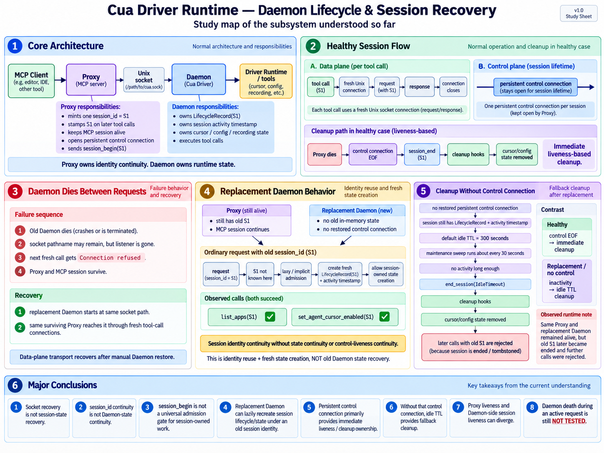

# Cua Driver — Daemon Lifecycle / Recovery

## Investigation goal

Understand what breaks, survives, and recovers when the long-running Daemon
disappears while an MCP Proxy and logical session remain alive.

This investigation now has one completed slice and one next boundary:

1. **Completed enough:** Daemon dies between requests → replacement Daemon → old
   session identity is lazily admitted → fresh Daemon-side state is created →
   cleanup falls back to idle lifecycle expiry when the control connection is
   not restored.
2. **Next boundary:** Daemon dies **during an active request**, where the caller
   may not know whether a side effect happened before the response was lost.

## Visual learning record

Keep all meaningful diagrams for this investigation. Earlier diagrams may show
an inference that was later corrected; the README text below is the source of
truth for the current model.

### Initial lifecycle-break flow


### Consolidated daemon lifecycle / session recovery study map



## Healthy runtime design

```text
MCP Client → cua-driver mcp Proxy → Unix socket → Cua Daemon → Driver
```

Two different connection roles matter:

- **Data plane:** each normal tool call uses a fresh Unix connection.
- **Control plane:** at Proxy startup, the Proxy mints one internal
  `session_id`, opens a persistent connection, and sends
  `session_begin(session_id)`. That long-lived connection gives the Daemon a
  direct liveness / cleanup relationship with the Proxy session.

The important ownership split is:

```text
Proxy
- owns logical session identity continuity
- mints/stamps session_id on later requests
- owns MCP/client continuity
- owns the persistent control connection

Daemon
- owns process-local lifecycle records
- owns session activity / in-flight bookkeeping
- owns cursor/config/runtime state
- executes tool calls
```

Sharing the same `session_id` does **not** mean Proxy and Daemon share memory.

---

## Experiment 1 — Daemon dead before next request

### Prediction

The next call would reveal whether the Proxy/session survived, how the missing
Daemon failure crossed MCP, and whether anything restarted it.

### Baseline

The Daemon, Proxy, MCP session, socket path, and `list_apps` were healthy.

### Break introduced

Only the Daemon was terminated. It was dead **before** the next `list_apps`.
This is not a Daemon-dies-during-request test.

### Exact observed result

- Old Daemon PID 5263 was gone; Proxy PID 69593 and the MCP session survived.
- The socket pathname remained, but no Daemon listener existed.
- No replacement `cua-driver serve` appeared automatically.
- The first and second `list_apps` calls through the same session failed with a
  Daemon transport/MCP tool error caused by `Connection refused`.

### Failure boundary

```text
MCP Client → existing Proxy → fresh Unix connect → no Daemon listener
→ Connection refused → Proxy transport/MCP tool error → Agent tool failure
```

### What survived

- MCP client/session
- Proxy process
- Proxy-held logical session identity
- socket pathname

### What disappeared

- Daemon process and Unix listener
- old Daemon process memory
- old persistent Proxy ↔ Daemon control connection

### Conclusion

Proxy and Daemon are separate failure domains. A socket pathname is an address,
not proof that a listener or process is alive. The running Proxy did not
perform steady-state Daemon supervision/restart.

---

## Unix socket lifecycle

```text
socket pathname exists
!= listener exists
!= Daemon alive
```

A replacement startup can remove/replace a stale endpoint and bind a **new**
listener at the same configured path. Reusing the path does not preserve the old
Daemon or its memory.

## Startup ownership vs steady-state supervision

At Proxy startup, source inspection showed: check Daemon liveness, launch
`CuaDriver.app` / `serve` if needed on macOS, wait, then enter Proxy operation.
Later per-tool forwarding does not invoke that startup path.

```text
startup auto-launch != steady-state Daemon supervision
```

---

## Experiment 2 — manually restore replacement Daemon

### Setup

The same MCP client/session and Proxy remained alive. A replacement Daemon was
manually started at the same socket pathname.

### Observed result

The same Proxy/session called `list_apps` successfully after the replacement
started.

### Why data-plane transport recovered

```text
tool call → UnixStream::connect(socket) → request → response → connection ends
next tool call → another fresh connection
```

Once a replacement listened at the same address, a later fresh connection could
reach it.

### Conclusion

- **Automatic Daemon recovery:** not observed.
- **Data-plane recoverability after external/manual restore:** verified.
- A successful stateless call did **not** yet prove session/control-state
  recovery.

---

## Experiment 3 — replacement Daemon receives the old session identity

This experiment used a clean manually observed baseline rather than an old MCP
route whose control relationship was already missing.

### Valid runtime baseline

- fresh Proxy PID: `14126`
- old Daemon PID: `48613`
- replacement Daemon PID: `19835`
- Proxy session: `mcp-14126-1788769126087137000`
- pre-break `set_agent_cursor_enabled(enabled=true)`: succeeded

The healthy Proxy had minted S1 and established its normal control relationship
before the old Daemon was killed.

### Break and replacement

1. Kill only old Daemon `48613`.
2. Preserve Proxy `14126` and its MCP stdin/session.
3. Start replacement Daemon `19835` at the same socket path.
4. Do **not** send a new `session_begin(S1)` to the replacement.

### User prediction before the test

> Stateless work may recover, but session-owned/stateful work should be rejected
> without a restored live control relationship.

### Observed result

Using the same surviving Proxy and old S1:

- `list_apps(S1)` → **succeeded**
- `set_agent_cursor_enabled(S1)` → **succeeded**
- the stateful response returned the same old session identity

The prediction did **not** match the runtime behavior.

### Source-backed explanation

Current source showed that an unknown, non-ended session identity can be
implicitly admitted on an ordinary session-requiring action:

```text
request arrives with old S1
→ S1 is unknown in replacement process
→ S1 is not tombstoned/ended there
→ begin_session_dispatch admits it
→ create fresh LifecycleRecord(S1)
→ create/refresh activity timestamp
→ allow fresh session-owned state under S1
```

The replacement Daemon did **not** recover the old Daemon's memory. It reused
the logical identity and created fresh Daemon-side state.

### Corrected conclusion

```text
session identity continuity
!= Daemon state continuity
```

Replacement behavior is best described as:

> **identity reuse + fresh state creation**

not old-state restoration.

### What lazy admission provides

Lazy/implicit admission gives useful availability properties:

- the surviving Proxy/MCP client does not need to restart merely because the
  Daemon was replaced;
- later data-plane requests can continue with the same logical session identity;
- Daemon-side lifecycle/state can be recreated on demand;
- session separation still has a stable identity key.

It does **not** provide:

- restoration of old in-memory cursor/config/runtime values;
- restoration of the old persistent control connection;
- proof that every possible session-owned resource has identical recovery
  semantics.

---

## Source model — why the persistent control connection still matters

The successful stateful call corrected an earlier inference: `session_begin(S1)`
is **not** a universal admission gate for every session-owned action.

That does not make the control connection unnecessary.

### Healthy cleanup path

```text
Proxy S1
  │
  └── persistent control connection ──► Daemon

Proxy dies
→ OS closes connection
→ Daemon sees EOF
→ end_transport_sessions(S1)
→ normal session-end cleanup hooks
→ remove S1-owned state
```

The control connection is therefore primarily a strong, immediate liveness /
cleanup relationship. It is not there to keep the Daemon process alive.

Process lifetime independence is intentional:

```text
Proxy may die
Daemon may remain alive
```

Because the Daemon may remain alive while holding session-owned state, it needs
a way to learn promptly that the owner disappeared. Control EOF provides that
signal without polling.

### After Daemon replacement

The old control task exits on Daemon EOF/error and has no reconnect loop in the
traced source. Later normal calls still carry old S1, but the replacement Daemon
never receives a new persistent `session_begin(S1)` from that surviving Proxy.

So after lazy admission the system can have:

```text
Proxy: old S1 identity exists                  ✅
Replacement Daemon: fresh LifecycleRecord(S1) ✅
Fresh session-owned state                     ✅
Restored persistent control connection        ❌
```

This is:

> **session-identity continuity without state continuity and without restored
> control-liveness continuity.**

---

## Cleanup source trace — fallback ownership without control reconnect

Source inspection established that an implicitly admitted session still gets
normal lifecycle tracking even without an active control connection.

For an admitted old S1:

- a `LifecycleRecord` is created;
- session activity is inserted/refreshed;
- default idle TTL is `300` seconds unless a trusted context overrides it;
- initial admission and completion of admitted dispatch refresh activity;
- in-flight dispatch is tracked so idle eviction does not race active work;
- a lifecycle maintenance task sweeps roughly every `30` seconds;
- stale sessions with no in-flight work are ended with
  `SessionEndReason::IdleTimeout`;
- normal session-end hooks then clean session-owned state such as the traced
  macOS cursor/config state.

The idle reaper consults lifecycle/activity state, not the control-connection
registry. Therefore it can operate even when the replacement Daemon has no
persistent control relationship for S1.

### Cursor/config cleanup path traced

```text
idle/session end
→ end_session_with_reason(...)
→ finish_session_end / session-end fan-out
→ macOS session-end hook
→ clear per-session config override
→ CursorRegistry::remove(session_id)
→ cursor overlay/session state removed
```

Other session-owned resource families were not exhaustively runtime-tested in
this replacement scenario.

---

## Experiment 4 — session expiry while Proxy and Daemon both stay alive

The next prediction was initially framed as:

> If the surviving Proxy later dies, recreated state should remain for a while
> and then be cleaned by the roughly 300-second idle TTL.

Before killing the Proxy, the existing S1 was queried again after a long idle
period.

### Observed result

`get_agent_cursor_state` returned:

```text
session 'mcp-14126-1788769126087137000' has ended;
tool call 'get_agent_cursor_state' was rejected
```

Process checks then verified:

- Proxy `14126` was still alive — same process
- replacement Daemon `19835` was still alive — same process

So Proxy death was not required for S1 to become ended.

### Runtime logging boundary

macOS unified-log queries, including `--info --debug`, did not expose a
session-specific runtime message proving that this exact transition carried
`SessionEndReason::IdleTimeout`.

Evidence classification must remain precise:

**OBSERVED**

- replacement Daemon had previously accepted and created state under old S1;
- same Proxy remained alive;
- same replacement Daemon remained alive;
- later the same S1 was reported as ended and further calls were rejected.

**SOURCE-VERIFIED**

- implicitly admitted sessions receive normal lifecycle/activity tracking;
- default idle TTL is 300 seconds;
- lifecycle maintenance runs about every 30 seconds;
- idle expiry invokes the normal session-end path and cleanup hooks.

**STRONG INFERENCE**

- this observed S1 expiry was caused by the idle reaper.

**NOT DIRECTLY OBSERVED**

- the exact runtime end reason/timestamp for this S1 was emitted as
  `IdleTimeout` in logs.

---

## Corrected inferences from the investigation

### Wrong inference 1

> A replacement Daemon that never received `session_begin(S1)` should reject
> session-owned/stateful work.

**Corrected:** at least one clearly session-owned operation was accepted. An
unknown, non-ended S1 can be lazily admitted and fresh Daemon-side lifecycle
state can be created.

### Over-strong inference 2

> If the control connection is not restored, recreated S1 state may become
> permanently orphaned because Proxy death cannot deliver EOF to the replacement
> Daemon.

**Corrected:** loss of control reconnect removes the immediate liveness-based
cleanup path, but the session still participates in inactivity-based lifecycle
cleanup. The Proxy itself can remain alive while the replacement Daemon expires
and tombstones an idle S1.

### Final cleanup contrast

```text
HEALTHY SESSION
Proxy dies
→ control EOF
→ immediate deterministic session cleanup

REPLACEMENT SESSION WITHOUT CONTROL RECONNECT
ordinary request lazily creates/refreshes S1 lifecycle
→ no direct Proxy-liveness signal
→ inactivity reaches idle TTL
→ maintenance sweep
→ session end + cleanup hooks
```

So the persistent control connection and idle TTL provide different guarantees:

- **control connection:** immediate liveness-based cleanup;
- **idle TTL:** delayed inactivity-based fallback cleanup.

---

## Final established lifecycle model — between requests

1. Proxy and Daemon are independent process/failure domains.
2. Normal tool calls use fresh data-plane Unix connections.
3. Proxy owns logical session identity continuity; Daemon owns process-local
   runtime/session state.
4. If Daemon dies between requests, Proxy and S1 may survive while Daemon memory,
   listener, and old control connection disappear.
5. A surviving Proxy does not automatically restart/reconnect the Daemon control
   plane during steady state.
6. A manually restored Daemon at the same socket address can serve later fresh
   tool connections.
7. An old, non-ended session identity can be lazily admitted by the replacement
   Daemon.
8. Lazy admission creates fresh lifecycle/session state; it does not restore old
   Daemon memory.
9. `session_begin`/persistent control is not a universal gate for every
   session-owned action.
10. The persistent control connection still matters because it provides fast,
    deterministic owner-liveness cleanup via EOF.
11. Without restored control, normal activity/TTL lifecycle tracking still
    bounds the recreated session; idle expiry is the fallback cleanup mechanism.
12. Proxy liveness and replacement-Daemon session liveness can diverge: Proxy may
    still be running while S1 has already expired/tombstoned.

This between-request replacement/session-cleanup slice is **complete enough** to
move on.

---

## Tested vs not tested

### TESTED

- Daemon dead **before** next request.
- socket pathname remains while listener is gone.
- no automatic steady-state restart observed.
- same Proxy reaches a manually restored replacement Daemon.
- stateless request succeeds after replacement.
- clearly session-owned cursor operation succeeds using old S1 without a new
  persistent `session_begin(S1)`.
- replacement creates/uses fresh Daemon-side state under old S1.
- same Proxy and same replacement Daemon can remain alive while old S1 later
  becomes ended and rejects further calls after inactivity.

### SOURCE-VERIFIED, NOT FULLY RUNTIME-PROVEN FOR EVERY RESOURCE

- implicit session lifecycle/activity tracking;
- 300-second default idle TTL;
- ~30-second lifecycle sweep;
- in-flight protection;
- normal session-end hook fan-out;
- traced cursor/config cleanup.

### NOT TESTED

- Daemon dies **during an active request**.
- side effect occurs but response is lost.
- partial execution and retry safety.
- whether a caller can distinguish “not executed” from “executed but response
  lost”.
- idempotency/deduplication guarantees for mutating tool calls.
- all session-owned resource families under replacement/recovery.

---

## Related issue / PR context

- `#1777` — session identity/lifecycle model and idle-reaper context
- PR `#1779` — persistent control connection / immediate cleanup; mid-session
  Daemon control reconnection explicitly deferred
- `#2618` — Daemon disappearance followed by `Connection refused` (closed)
- `#3337` — abnormal exit can leave external Linux MPX state behind
- `#2002` — opposite lifecycle direction / cleanup ownership problem

These are design/history context, not automatically selected contribution
targets.

---

## Next engineering question

> **What guarantees exist when the Daemon dies during an active tool request,
> after dispatch may have begun and a side effect may already have happened, but
> before the Proxy receives a response?**

The reliability questions are now:

- where exactly is the request considered admitted/executing?
- what does the Proxy observe if the Daemon process disappears mid-call?
- can the caller know whether the action never ran, partially ran, or completed
  before the response was lost?
- does Cua automatically retry anything?
- what request identity/idempotency/deduplication mechanisms exist, if any?
- which operations are safe to retry and which are ambiguous?

## Minimum next source trace

Before another runtime break, inspect only the path needed to place the
mid-request failure boundaries:

1. Proxy per-tool request write/read/error path.
2. Daemon request receive + session dispatch admission.
3. Tool execution start/end and `in_flight` lifecycle bookkeeping.
4. Response serialization/write back to the Proxy.
5. Any existing retry, request-id, idempotency, or deduplication mechanism.
6. Only then choose one safe, observable test operation whose execution window
   can be controlled enough to distinguish outcomes.

Do not broad-reconnoiter the Driver repository.

## Next experiment ownership

The first important mid-request lifecycle reproduction should be **Human +
ChatGPT** if it depends on preserving an exact Proxy/Daemon/request and killing
one process at a precise boundary. Codex should first supply the bounded local
source trace and can automate/repeat later if a deterministic harness becomes
useful.

Ask the user for a prediction before the runtime break.

## Stopping boundary

Do not implement a fix or choose a retry architecture yet.

First establish the active-request execution/acknowledgement boundary and the
current failure contract. Do not describe Daemon death during active execution
as reproduced until that experiment is actually performed.
