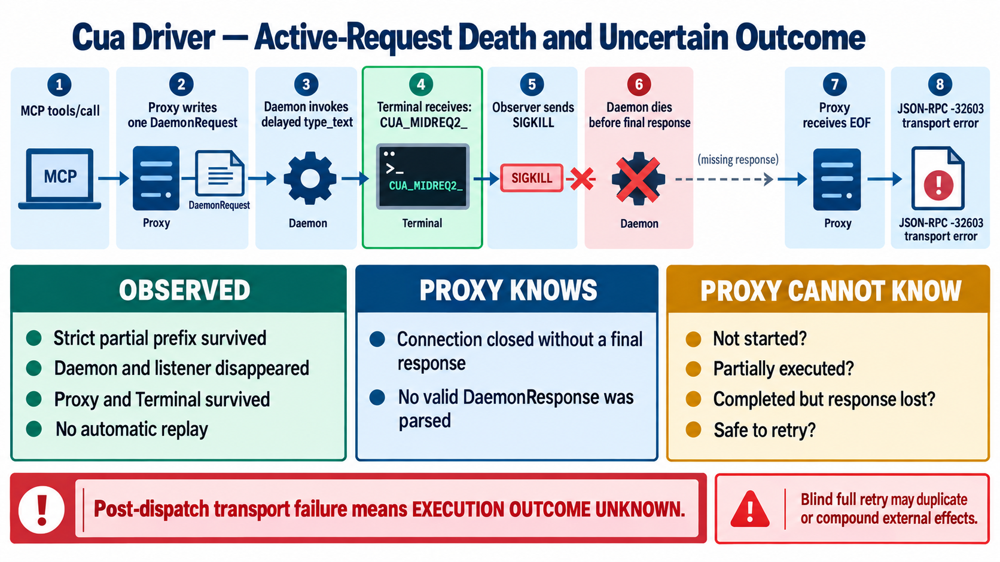
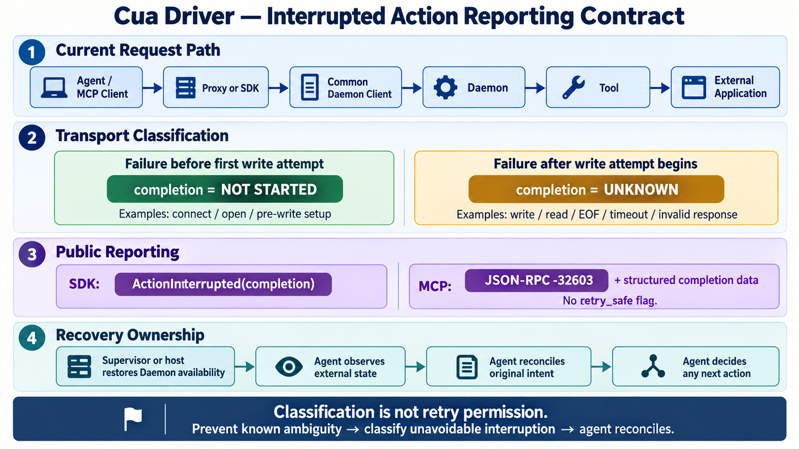

# Daemon Lifecycle — Active-Request Death

## Engineering question

When the Daemon disappears after a mutating tool call may have started but
before the Proxy receives a final response, what can the caller know about the
external effect and retry safety?

## Canonical experiment visual



## Source-verified execution path

```text
MCP tools/call + JSON-RPC id
→ Proxy keeps the outer id
→ DaemonRequest(method="call", name, args, session_id)
→ one fresh Unix connection
→ request frame written
→ Daemon parses and admits dispatch
→ process-local in_flight guard acquired
→ optional action-history start
→ tool.invoke(args) performs the platform effect
→ result/history projection
→ final DaemonResponse written
→ Proxy parses response or reports transport failure
```

Important boundaries:

- `DaemonRequest` carries no request id, idempotency key, attempt number, or
  deduplication key.
- The Daemon sends no admission/execution-start acknowledgement.
- The first positive acknowledgement visible to the Proxy is the final
  `DaemonResponse`.
- `tool.invoke(...)` runs before that response is constructed.
- The Proxy issues one daemon request and does not reconnect/replay it.
- `idempotentHint` is advisory metadata, not retry or deduplication machinery.
- `in_flight` is process-local cleanup protection, not durable execution proof.

Acknowledgement invariant:

```text
final response parsed
→ Daemon reported an outcome

no final response after request dispatch
→ execution outcome is unknown to the Proxy
```

The response path alone cannot distinguish not started, partially executed,
completed, or completed with its response lost.

## Experiment design

Use delayed, character-by-character `type_text` against a disposable Terminal
prompt. The payload contains no newline or shortcut, so a partial marker is
visible but cannot execute a command.

The important break must be conditioned on an observed external effect rather
than a fixed timer. A one-shot observer therefore watches the exact Terminal tab
and kills only the verified Daemon after the unique prefix appears.

Human prediction:

> Terminal will retain a non-empty partial prefix, and the Proxy will return a
> transport error.

## Invalid attempt 1 — killed before dispatch

Baseline:

- Proxy `17783`;
- Daemon `19835`;
- session `mid-request-20260908`;
- disposable Terminal `63260` / `24885`.

The scheduled kill fired before `type_text` connected. The Proxy returned
`Connection refused`; the marker was absent. This repeated the already-known
between-request failure and did **not** test active execution.

Recovery required a new task/connector after the app-owned Proxy was explicitly
terminated. Repeated `start_session` inside the stale task continued to return
`Transport closed`, proving that another message did not create a fresh
connector.

## Invalid attempt 2 — global input lost the target

A fresh task established session `mid-request-20260908-resume`, reached Daemon
`65529`, and completed ordinary read-only preflights. Candidate Proxy `68340` was
selected from process start time; the connector did not expose its PID directly.

Desktop-scope typing returned `effect:"unverifiable"`, Terminal remained
unchanged, the observer timed out, and the Daemon survived. Codex had regained
foreground before global synthesis ran.

Source inspection established the smallest correction: exact-window foreground
typing for a Terminal target skips the ineffective AX insertion path, fronts the
exact window, and emits delayed CGEvents character by character.

No ambiguous action was retried because direct observation proved that the
first marker was absent.

## Valid attempt — effect-conditioned Daemon death

Verified baseline:

- fresh-task Proxy candidate `68340`;
- Daemon `65529` with the expected listener;
- session `mid-request-20260908-resume`;
- Terminal `63260` / window `24885` at an idle prompt;
- exact-window foreground `type_text`, `delay_ms:200`;
- payload `CUA_MIDREQ2_20260908_ABCDEFGHIJKLMNOPQRSTUVWXYZ`.

The observer detected `CUA_MIDREQ2_` in the exact front Terminal tab, then sent
`SIGKILL` only to Daemon `65529`.

Observed:

- Terminal retained exactly `CUA_MIDREQ2_`;
- Daemon and listener disappeared;
- Proxy candidate and Terminal survived;
- the same call returned:

```text
daemon transport error forwarding `type_text`:
daemon closed connection without response
```

- no automatic Proxy replay occurred;
- the marker was not retried.

The human prediction matched the observed result.

## What the evidence proves

### OBSERVED

- the request was executing far enough to create a partial external effect;
- the Daemon died before a final response arrived;
- the Proxy surfaced only a transport error;
- external Terminal state survived process death.

### SOURCE-VERIFIED

- effect execution precedes final response construction;
- daemon-wire request identity/deduplication is absent;
- the Proxy does not replay the logical action;
- process-local execution bookkeeping dies with the Daemon.

### CONCLUSION SUPPORTED BY BOTH

> A post-dispatch transport error cannot be interpreted as “the action did not
> run.” Blind retry of a mutating action may repeat or compound an effect that is
> already partial or complete.

### NOT TESTED

- a completed effect followed by response loss;
- behavior of a real caller retry;
- a deduplicating or exactly-once design;
- optional action-history evidence after this killed Daemon.

## Human explain-back

The human correctly separated the two evidence domains:

- the Proxy knows that the established connection closed without a valid final
  response;
- the Proxy cannot infer the execution state from that response path;
- independent Terminal observation proved partial execution in this run;
- replaying the full marker after restoration could append a second full effect
  to the surviving prefix.

This active-request execution/acknowledgement slice is GREEN enough.

## Related issue and PR context

- [#1777](https://github.com/trycua/cua/issues/1777) remains open for session
  lifecycle follow-ups. Merged PR `#1779` added the persistent Proxy control
  connection and deferred reconnect across Daemon replacement.
- [#2618](https://github.com/trycua/cua/issues/2618) was closed by merged PR
  `#2631`, which removed one concrete Linux Daemon-exit cause rather than adding
  replay/deduplication.
- [#3300](https://github.com/trycua/cua/issues/3300) was closed by merged PR
  `#3314`, which kept the permission-gated macOS Daemon stable and rejected work
  before execution with a typed pending status.
- [#3337](https://github.com/trycua/cua/issues/3337) was closed by merged PR
  [#3601](https://github.com/trycua/cua/pull/3601), which repairs owned orphaned
  Linux/X11 input-device state after abnormal exit.
- [#3656](https://github.com/trycua/cua/issues/3656) remains open for a current
  Windows UIA crash that produces the same response-less transport symptom.

A bounded GitHub search on 2026-09-08 found no direct issue or PR implementing
daemon-wire request identity, mutating-call deduplication, or automatic Proxy
replay.

## Contribution classification

This is not a proven automatic-retry bug: the Proxy sends one request and does
not replay it. Response loss is expected to be ambiguous without a stronger
protocol.

The concrete gap is incomplete implementation/parity of RFC 2549's existing
interrupted-action reporting contract:

- connect-before-dispatch and post-write outcome-unknown failures both become
  generic JSON-RPC `-32603`;
- the Proxy comment describes transport failure as “I couldn't reach the tool
  at all,” contradicted by the reproduced partial effect;
- the string says no response arrived but provides no stable execution-phase or
  outcome classification.

Candidate invariant:

> After request dispatch, a client-visible transport failure must not imply
> “not executed” or “safe to retry”; execution outcome must be unknown.

A deeper duplicate/RFC audit found that RFC 2549 already requires interrupted
actions to report completed, failed-before-side-effect, or unknown completion;
its MCP slice and acceptance plan require honest interrupted-action reporting
across adapters. PR #2561 implemented that RFC, but ordinary Daemon/MCP action
errors still collapse the distinction.

Therefore no new RFC is proposed. The current external artifact is a focused
bug-form draft:

- [RFC 2549 parity bug draft](./external-bug-form-draft.md)

The previously approved design visual remains local learning material only:



The obsolete new-RFC drafts and detailed proposal notes were removed after user
approval. The bug draft has not been posted, and the visual is explicitly
excluded from any external report.

## Human #2686 architecture explain-back — 2026-09-11

After guided vocabulary and HLD grounding, the human independently explained
the issue path: the SDK opens a Unix-socket channel and sends the complete
request; the separate Daemon performs the keyboard events; Linux waits 10 ms
per character, so 16,000 characters require about 160 seconds before the final
response can be constructed; the SDK's 120-second response timeout does not
send cancellation, so the Daemon may continue after Python receives an error.
The human also explained why blindly retrying a non-idempotent `type_text` can
duplicate or corrupt surviving target state.

This establishes the issue-level HLD and failure mechanism as GREEN enough.
Runtime reproduction of #2686 and human-owned PR/test analysis remain YELLOW.

## Issue #2686 reproduction — healthy baseline 2026-09-11

A disposable Ubuntu 24.04 Linux arm64 container provided Xvfb, Openbox, GTK3,
the real Cua Daemon built from commit
`648c251400ebb356f6d7dbc3d0c835690b9bb4b4`, and the generated Python SDK/native
library. The Cua checkout was mounted read-only; Cargo caches/build artifacts
and all fixture state remained in disposable Docker storage or `/private/tmp`.

The first ambient-desktop-focus attempts were invalid: the GTK entry received
only changing suffixes of the short marker. Adding a delay and repeatedly
presenting the GTK window did not establish stable focus. An exact-window typed
call then returned a structured `background_unavailable` refusal because Linux
X11 has no focus-free input backend for that target. These runs tested fixture
setup, not issue #2686.

The valid baseline used an exact-window foreground click to focus the GTK entry,
then invoked the original desktop-scope Python `type_text` path with marker
`CUA_2686_HEALTHY`.

OBSERVED:

- Python returned success in 0.197 seconds;
- the target recorded exactly all 16 marker characters;
- the Daemon remained alive after the call.

The 16,000-character action has not run. Its prediction gate is now active.

## Preliminary Codex-only PR #2743 audit — 2026-09-10

This section preserves source findings for later validation. It is not yet the
human's review: the human explicitly stopped publication planning to first
understand the relevant architecture, reproduce issue #2686, and inspect the PR
from that evidence.

PR #2743 is the existing implementation path for issue #2686. Its single
commit changes `cua-driver-core::daemon::send_request` from a fixed 120-second
response deadline to a Linux `type_text`/`type_text_chars`-aware deadline and
adds a process-wide environment override. It does not add replay or alter
Daemon execution order.

What it fixes:

- a healthy Linux `type_text` using the current 10 ms per-character XTest pace
  can wait beyond 120 seconds;
- callers can override the daemon response deadline;
- ordinary requests retain the current 120-second default.

What it leaves unresolved:

- `send_request` still returns one untyped `anyhow::Error` for connect, write,
  response timeout, EOF, read, and decode failures;
- the ordinary SDK Daemon action path still maps all such failures to
  `DriverError::Transport`;
- the MCP Proxy still maps them to JSON-RPC `-32603` without stable completion
  data;
- therefore a timeout or response loss after the write begins remains
  semantically `Unknown`, but callers receive no typed indication of that fact.

This is a reviewable gap because issue #2686 itself asks for typed unknown
outcome after post-dispatch timeout, and RFC 2549 requires interrupted actions
to report known or unknown completion honestly. Extending the deadline reduces
one predictable false timeout; it cannot prove whether an action completed when
the extended deadline or response path still fails.

There is also a bounded deadline-policy defect: the PR applies a fixed 10 ms per
character estimate to `type_text_chars`, but that tool defaults to 30 ms and
accepts arbitrary `delay_ms`. A sufficiently long default or custom-delay call
can therefore still outlive the calculated deadline.

The PR was revalidated as open on 2026-09-10. It has one maintainer
`CHANGES_REQUESTED` review because the Python fake daemon responds immediately,
so the test passes under the old 120-second implementation. It is also
merge-conflicted, 594 commits behind current `origin/main`, and has had no
update since 2026-08-27. The existing review objection should not be duplicated.

## Source landmarks

- `libs/cua-driver/rust/crates/cua-driver/src/proxy.rs::forward_tool_call`
- `libs/cua-driver/rust/crates/cua-driver-core/src/daemon.rs::send_request`
- `libs/cua-driver/rust/crates/cua-driver/src/serve.rs::invoke_daemon_tool`
- `libs/cua-driver/rust/crates/platform-macos/src/tools/type_text.rs`

## Stop boundary

Do not repeat the marker, open the bug issue, upload its visual, or begin source
changes until the human reviews the focused draft and explicitly authorizes the
external step. Do not create a new RFC for this already-governed contract.
