# Daemon Lifecycle / Recovery Mind Map

This map summarizes the current mental model. Solid branches are established
from runtime evidence or source/design history. Items marked `UNKNOWN` or
`HYPOTHESIS` are the next issue-driven questions.

```mermaid
flowchart TD
    A[Daemon Lifecycle / Recovery]

    A --> B[Process lifetime]
    B --> B1[Proxy and Daemon are separate processes]
    B --> B2[Proxy can survive Daemon death]
    B --> B3[MCP session can survive failed tool call]

    A --> C[Unix socket]
    C --> C1[Stable pathname]
    C --> C2[Listener belongs to current Daemon process]
    C --> C3[Stale pathname can remain after abnormal exit]
    C --> C4[Startup removes stale path before bind]
    C --> C5[Path exists != Daemon available]

    A --> D[Proxy startup ownership]
    D --> D1[Check Daemon liveness before run_proxy]
    D --> D2[Launch CuaDriver.app if absent on macOS]
    D --> D3[No verified steady-state watchdog in Proxy path]

    A --> E[Data plane]
    E --> E1[Fresh Unix connection per tool call]
    E --> E2[Daemon dead -> connect refused]
    E --> E3[Replacement Daemon at same path -> later list_apps succeeds]
    E --> E4[Transport recoverability once runtime is restored]

    A --> F[Control plane]
    F --> F1[Proxy mints one session_id]
    F --> F2[Long-lived control connection]
    F --> F3[session_begin registers session with Daemon]
    F --> F4[Control EOF drives session_end cleanup]
    F --> F5[Daemon death destroys this control connection]
    F --> F6[Mid-session control reconnection currently deferred]

    A --> G[Daemon-owned session state]
    G --> G1[Cursor / overlay ownership]
    G --> G2[Per-session config overrides]
    G --> G3[Owned recording]
    G --> G4[Other daemon-side session bookkeeping]
    G --> G5[Daemon replacement destroys old process memory]
    G --> G6[Same session_id string != reconstructed server-side session]

    A --> H[Recovery distinction]
    H --> H1[Automatic runtime recovery: not observed]
    H --> H2[Recoverability after external/manual Daemon restore: yes for list_apps]
    H --> H3[Control/session recovery: incomplete / unknown]

    A --> I[Candidate correctness risk]
    I --> I1[HYPOTHESIS: old Proxy can send old session_id to new Daemon]
    I --> I2[HYPOTHESIS: new session-owned state may be created without live control reaper]
    I --> I3[Must verify before calling it a bug]

    A --> J[Design questions]
    J --> J1[Reconnect control channel automatically?]
    J --> J2[Replay session_begin or mint new generation?]
    J --> J3[What state is safe to restore?]
    J --> J4[What state must be invalidated?]
    J --> J5[Should calls block until control registration succeeds?]
    J --> J6[Which layer retries?]
    J --> J7[How to handle concurrent calls during restart?]
    J --> J8[Does cached tool list remain valid after replacement?]
    J --> J9[How to identify Daemon generation?]

    A --> K[Real issue connections]
    K --> K1[#1777 session identity model]
    K --> K2[PR #1779 persistent control connection; restart-mid-session reconnect deferred]
    K --> K3[#2618 real Daemon exit -> Connection refused]
    K --> K4[#3337 crash/revive -> external MPX state leak]
    K --> K5[#2002 opposite direction: session ends but runtime/resource lingers]

    A --> L[Next issue-driven path]
    L --> L1[Read minimum design history]
    L --> L2[Trace control registration and session ownership]
    L --> L3[Establish Daemon-generation invariants]
    L --> L4[Compare recovery designs]
    L --> L5[Choose one real issue]
    L --> L6[Reproduce -> test -> propose -> PR]
```



## Core takeaway

```text
Daemon restart can restore the data plane without restoring the control plane.

same Proxy + same socket path + fresh per-call connect
    -> read-only call can work again

but

old persistent control connection + old daemon-owned session state
    -> do not automatically come back
```

That boundary is the current path from architecture learning into real issue
discovery.
