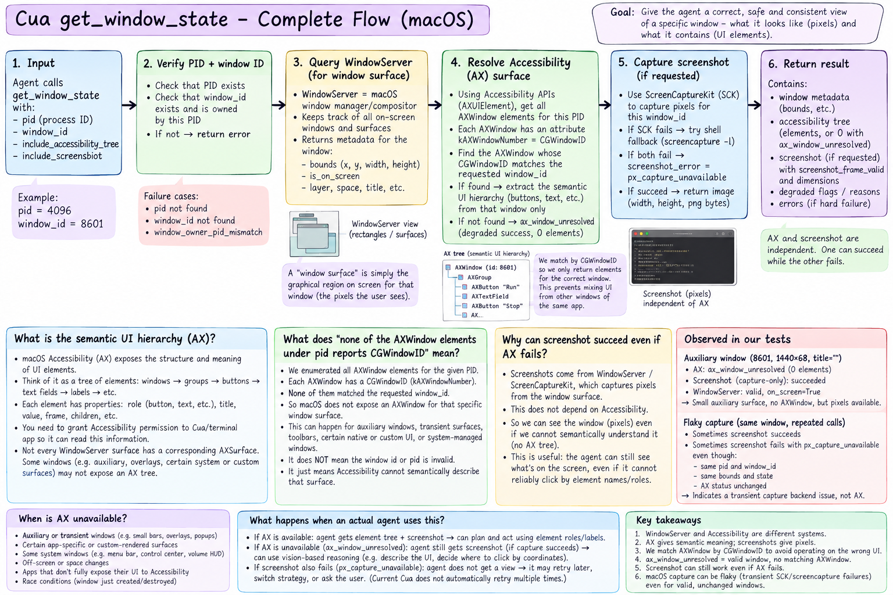

# Driver Runtime — Failure Experiments

## 1. PID / window ownership mismatch

**Prediction:** Calling `get_window_state` with a valid `window_id` but the wrong
`pid` should reach tool execution and fail target validation.

**Experiment:** `get_window_state(pid=<wrong>, window_id=<valid>)`

**Observed:**
- The request reached `get_window_state`.
- The tool returned `isError: true` with code `window_owner_pid_mismatch`.
- This was a tool execution error, not a JSON-RPC transport error.
- Ownership preflight rejected the request before the Accessibility tree walk
  and screenshot capture.
- The long-running daemon remained healthy after the failed request.

**Conclusion:** `get_window_state` verifies that the requested WindowServer
window belongs to the supplied PID instead of trusting the caller.

---

## 2. Stale / nonexistent window ID

**Prediction:** Calling `get_window_state` with a valid `pid` but a nonexistent
or stale `window_id` should reach tool execution and fail window-scope
validation.

**Experiment:** `get_window_state(pid=<valid>, window_id=<nonexistent>)`

**Observed:**
- The request reached `get_window_state`.
- The tool returned `isError: true` with code `window_id_not_found`.
- This was a tool execution error, not a JSON-RPC transport error.
- The request was rejected during window-scope preflight.
- Expensive Accessibility/screenshot observation did not proceed.
- The long-running daemon remained healthy after the failed request.

**Conclusion:** `get_window_state` verifies that the requested WindowServer
window still exists before producing an observation.

---

## 3. Live window with unresolved Accessibility surface

A WindowServer window can be valid and correctly owned by the requested PID,
while Cua cannot find an `AXWindow` whose `CGWindowID` corresponds to that exact
WindowServer window.

Observed first on auxiliary iTerm2 surface window 8601:

- The window existed and the correct PID owned it.
- Ownership preflight passed.
- `degraded: true`
- `degraded_reason: ax_window_unresolved`
- `element_count: 0`
- Cua deliberately did not substitute AX elements from another window or
  surface.

**Conclusion:** `ax_window_unresolved` is degraded success rather than a
target-validation error. Cua prefers an empty AX tree over returning semantic
UI from the wrong surface.

AX and screenshot capture are separate observation channels:

- AX can fail while screenshot succeeds.
- Screenshot can fail while AX remains usable.
- Both can fail in the same observation.

---

## Recording rules

- Normal expected failure: add one concise section here.
- Actual bug, upstream issue, or PR candidate: create
  `failures/<bug-slug>/README.md`, plus `repro.sh` only when a standalone
  reproduction is useful.
- A promoted bug README should contain only:
  - expected behavior
  - actual behavior
  - minimal reproduction
  - root cause/evidence
  - proposed fix or alternatives
  - upstream issue/PR link when applicable
