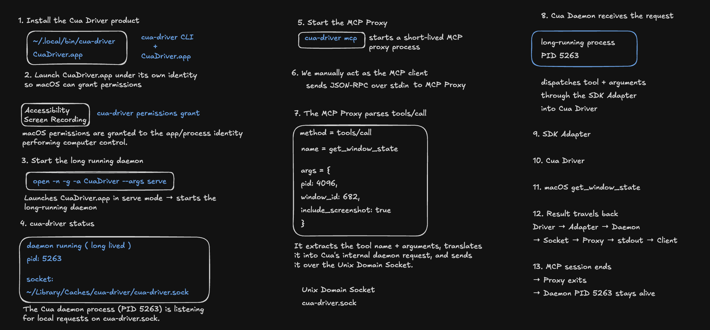

# Cua Driver — First `get_window_state` Happy Path

## Goal

Reproduce and retain the first successful macOS observation path using the
released/prebuilt Cua Driver:

```text
list_apps → list_windows → get_window_state(pid, window_id, include_screenshot=true)
```

## Architecture flow

```text
terminal MCP Client → cua-driver mcp Proxy → Unix socket → Cua Daemon
→ SDK Adapter → Cua Driver → macOS
```

## Final happy-path whiteboard



## Setup and verification

The released Cua Driver installation provides both `cua-driver` and
`CuaDriver.app`; they are not separately installed products.

```bash
cua-driver permissions grant
open -n -g -a CuaDriver --args serve
cua-driver status
```

`permissions grant` requests the CuaDriver.app identity's interactive macOS
Accessibility and Screen Recording/direct-capture grants. Starting the app in
`serve` mode creates the long-running daemon. `status` verifies the daemon,
its PID, and its Unix socket.

Each `cua-driver mcp` invocation starts a short-lived MCP Proxy. The terminal
then manually sends JSON-RPC on stdin, exercising the real proxy/socket/daemon
path rather than a direct Driver shortcut.

## Why the three calls

- `list_apps` discovers a running target PID.
- `list_windows` discovers an on-screen window ID for that PID.
- `get_window_state` returns Accessibility state and the requested window's
  screenshot.

One successful run observed `element_count = 371`,
`screenshot_frame_valid = true`, and `screenshot_mime_type = image/png`.
Those values are evidence from that run only; PIDs, window IDs, counts, and
dimensions are deliberately discovered at runtime.

## Proxy versus daemon lifetime

The experiment recorded `cua-driver status` before and after the three MCP
sessions. The same daemon PID remained alive after the individual proxy
processes exited with their stdin sessions. This proves the proxy/session and
daemon lifetimes differ.

## Run

```bash
./run.sh
```

`run.sh` keeps detailed runtime evidence in a temporary local directory and
produces the captured screenshot; these runtime artifacts are not committed.

## Stop boundary

Happy path is understood and experimentally verified. The next learning mode
is failure experiments: deliberately break assumptions and study the observed
boundaries.
